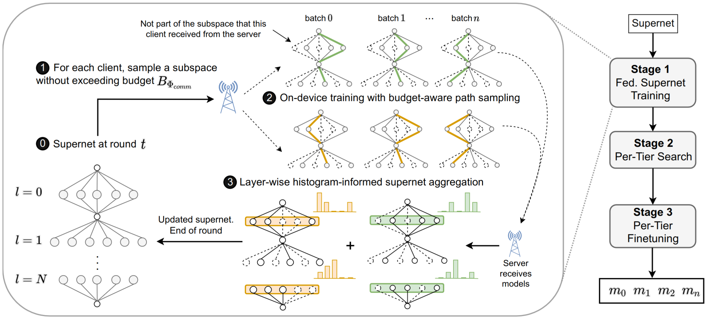
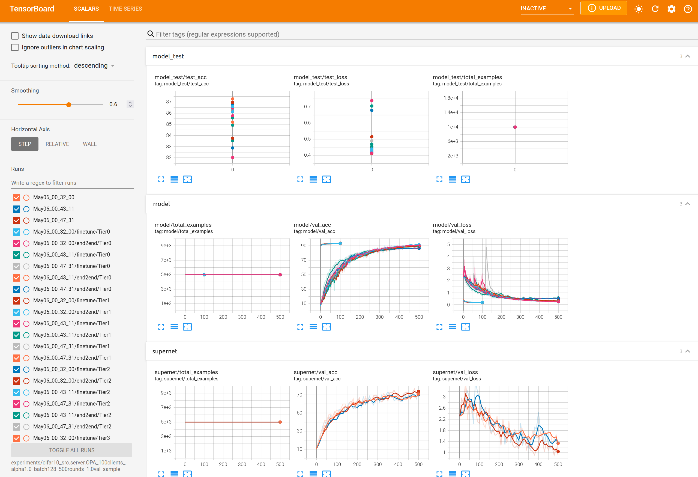

# FedorAS: Federated Architecture Search under system heterogeneity | [paper](https://arxiv.org/abs/2206.11239)


Federated learning (FL) has recently gained considerable attention due to its ability to learn on decentralised data while preserving client privacy. However, it also poses additional challenges related to the heterogeneity of the participating devices, both in terms of their computational capabilities and contributed data. Meanwhile, Neural Architecture Search (NAS) has been successfully used with centralised datasets, producing state-of-the-art results in constrained or unconstrained settings. However, such centralised datasets may not be always available for training. Most recent work at the intersection of NAS and FL attempts to alleviate this issue in a cross-silo federated setting, which assumes homogeneous compute environments with datacenter-grade hardware. 

In this paper we explore the question of whether we can design architectures of different footprints in a cross-device federated setting, where the device landscape, availability and scale are very different. To this end, we design our system, `FedorAS`, to discover and train promising architectures in a resource-aware manner when dealing with devices of varying capabilities holding non-IID distributed data. We present empirical evidence of its effectiveness across different settings, spanning across three different modalities (vision, speech, text), and showcase its better performance compared to state-of-the-art federated solutions, while maintaining resource efficiency.





## Reference

If you use our code for your work, please do not forget to cite us:


```
@article{2022fedoras,
  title={FedorAS: Federated Architecture Search under system heterogeneity},
  author={Dudziak, Lukasz and Laskaridis, Stefanos and Fernandez-Marques, Javier},
  journal={arXiv preprint arXiv:2206.11239},
  year={2022}
}
```


## Environment Setup


If you use `conda` follow the steps below. If you prefer not to, pip-install the `requirements.txt` directly.

```bash
# fresh conda environment
conda create -n fedoras python=3.8 -y
# access environment
source activate fedoras
# get a recent version of PyTorch
conda install pytorch==1.13.1 torchvision==0.14.1 torchaudio==0.13.1 pytorch-cuda=11.6 -c pytorch -c nvidia -y
# install requirements
pip install -r requirements.txt
```


## How to run FedorAS from scratch
FedorAS is comprised of three stages: (1) Federated Supernet training; (2) search; (3) per-tier federated finetuning. The default way of running FedorAS is by letting all three stages run one after another. If you have a supernet, you can skip stage (1) and do the search directly (see the last example command below). If you already know which model in the supernet you want to extract you can do so too (see the next section in the readme.) Throughout this project we make extensive use of [AwesomeYAML](https://github.com/SamsungLabs/awesomeyaml), a library that extends YAML making it a versatile configuration tool.

Here we describe how to launch CIFAR-10 experiments. You can follow a similar logic for CIFAR-100, SpeechCommands and Shakespeare. If the datasets/partitions are not found they will be downloaded. We provide a pre-trained supernet for CIFAR-10 for LDA=1.0 and 100 clients in the `releases` found in this repo ([click here](https://github.com/SamsungLabs/FedorAS/releases/latest))


```bash
# Run the CIFAR-10 experiment as described in the config file
python main.py configs/datasets/cifar10.yaml

# You can override everything in the config through the command line. For example, the below will
# set LDA to 0.1 and will set Ray to run concurrent 4 clients on each available GPU.
python main.py configs/datasets/cifar10.yaml dataset.lda_alpha=0.1 client.ray_resources=0.25

# If you already have a supernet trained, then you can use it to initialise the model in the server
python main.py configs/datasets/cifar10.yaml --supernet <path_to_your_supernet.pt>

# Or you could skip entirely the FL-superent training stage (i.e. Stage-I in FedorAS) and go straight to the search stage (Stage-II)
python main.py configs/datasets/cifar10.yaml --supernet <path_to_your_supernet.pt> --no-stage1
```

If you abruptly end the experiment (or if it crashes), it is adviced to stop all Ray processes runnig first before launching another experiment. You can do this directly from the terminal:
```bash
ray stop -f
```

## How to extract a model from a supernet and do FL

The script `normal_fl.py` allows you to access the logic in `src/finetune.py` (i.e. the code involving Stage-III of FedorAS) by supplying a `supernet` and a list of operation IDs for each layer (i.e. this list will be as long as layers were considered in the NAS stage). To call `normal_fl.py` you'll need to supply the same config file used to train the supernet; `--exp_dir` the directory created when training the supernet you want to extract the model from (this is important since that directory contains info about cluster-client assignments, etc); and the `--decision` which is a list of integers, each referring to the i-th operation to select from each layer.

```bash
python normal_fl.py configs/datasets/cifar10.yaml --exp_dir <your_exp_dir> --decision "4,5,8,3,8,8,4,5,6,8,3,2,6,3,5,8"  # if you pass --end2end, then the model extracted from the supernet will be trained from scratch

# alternatively to passing the decision you could pass instead the pickle containing the best model -- previously found in Stage-II -- of a particular tier (which should be in `exp_dir`)
python normal_fl.py configs/datasets/cifar10.yaml --exp_dir <your_exp_dir> --best_model_data best_model_bucket_0.pkl
```


## Experiment Outputs

Each experiment will generate `1 + 2N` models, where `N` is the number of tiers of devices: first, the supernet; then `N` models extracted from the supernet during the search stage and subsequently finetuned; and, those same `N` models but without making use of the pre-trained weights from the supernet and trained end-to-end in a FL manner (in essence here we train the models from scratch). Information relevant to each model is logged to a different `log.txt`. Similarly, each model writes to a different `tensorboard` record.
```bash
experiments/<your_experiment>
                    |
                    ├── log.txt # this is logs everything relevant to the supernet training stage (Stage I) and superent search (Stage-II)
                    ├── tensorboard/ # data points recorded during supernet training
                    |
                    ├── finetune # containing the result of each finetuned model from the supernet
                    |       ├── Tier1 # finetuning Tier1 model
                    |       |     ├── tensorboard/
                    |       |     └── log.txt
                    |       .
                    |       .
                    |       └── TierN
                    |             ├── tensorboard/
                    |             └── log.txt
                    |
                    └── end2end # contains models used for finetuning but trained from scratch
                           ├── Tier1 # finetuning Tier1 model
                           |     ├── tensorboard/
                           |     └── log.txt
                           └── TierN
                                 ├── tensorboard/
                                 └── log.txt
```
Given the above directory structure, you can launch tensorboard from the top level directory of your experiment to see all recorded metrics:

```bash
tensorboard --logdir experiments/<your_experiment>
```



## Reproducing Results

*    To reproduce the results in Table 5, run `.scripts/run.sh` script (this will take a while to complete)
*    To obtain a high performing (~63% acc) FL model on CIFAR-100 run `./scripts/golden_c100.sh`. Please note that this scripts assumes you previously run a standard FedorAS experiment for CIFAR-100 (i.e. you need to point it to a diretory where client-to-cluster assignentes can be found). If you previously run `.scritps/run.sh`, then you can pass the directory containing the CIFAR-100 experiments.


## Licence

The project's code is licensed under Apache License Version 2.0. More information in the LICENSE file.
